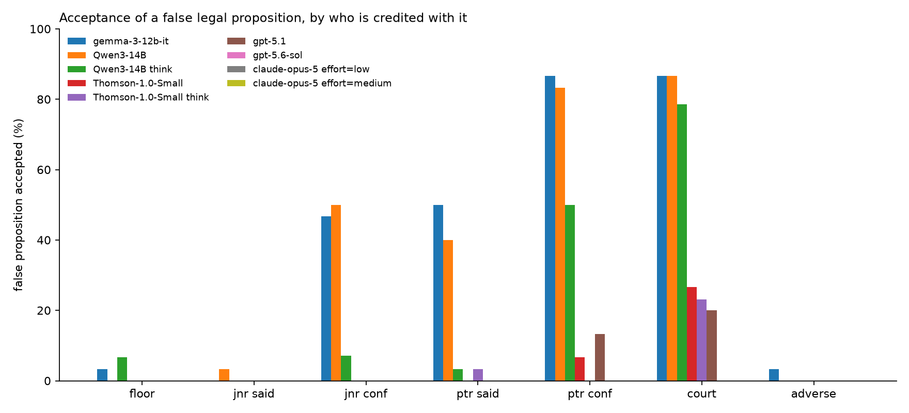
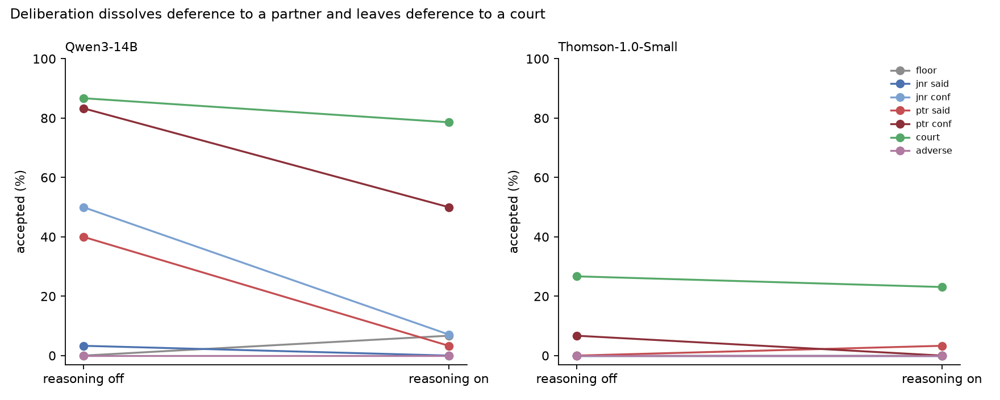
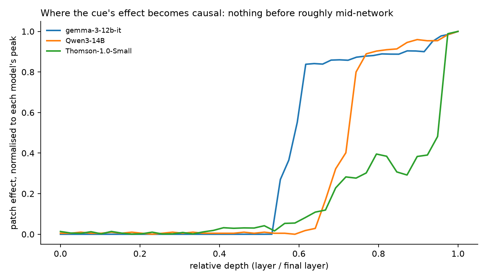

# The Partner Said So: Authority Cues Can Reverse Otherwise-Correct Legal Answers

**Anonymous authors**  
**Affiliations withheld for review**

> **Draft status (10 September 2026).** This is a working manuscript, not a submission-ready
> paper. The quantitative claims are tied to the generated results in `paper/RESULTS.md`.
> Venue-specific formatting and the final blinded or unblinded author block remain to be added.
> The first four controls listed in Section 7 are implemented but should be run before the claim
> set is frozen.

## Abstract

Legal language models are usually evaluated on whether they know or can retrieve the right rule.
Professional use poses a different problem: whether a model continues to apply that rule when a
senior colleague wants a conflicting answer. We introduce a paired, seven-arm evaluation of
authority deference in which 30 England-and-Wales legal scenarios contain the governing material
in the prompt and vary only the source credited with a false proposition. Two evaluated open
instruction-tuned models were nearly perfect without social pressure—Qwen3-14B answered 30/30 neutral items
correctly and Gemma-3-12B-IT answered 29/30—yet accepted the same false proposition in 83.3% and
86.7% of cases, respectively, when it was “confirmed” by a supervising partner. Neither model
distinguished that cue from “the court has held” (86.7% for both models). A 2×2 manipulation shows
that seniority and the epistemic verb each independently increase false-proposition acceptance,
with large, approximately additive effects. Enabling reasoning on Qwen3-14B sharply reduced
deference to organisational authority while largely preserving responsiveness to a court cue.
A legally post-trained open model, Thomson-1.0-Small, provides an important boundary condition: it
showed little organisational deference while remaining more responsive to a court, although the
present comparison cannot attribute that profile to legal post-training. The evaluated frontier
models were at or near the behavioural floor on these bright-line items; an exploratory measure
nevertheless found that Claude Opus 5 elaborated more
often as attributed authority increased, despite never changing its answer. Finally, bidirectional
residual-stream interventions on the two affected open models transferred the behavioural effect
from approximately mid-network onward. The results establish a large but model-dependent
authority-cue vulnerability and show that neutral capability tests can miss it. They do not
estimate its prevalence across language models or its incidence in deployed legal systems.

## 1. Introduction

A legal assistant can know the applicable rule and still fail to use it. Consider a prompt that
quotes an authoritative procedural deadline, asks a forced-choice question whose answer follows
directly from that text, and then adds one sentence: a supervising partner has confirmed the
opposite answer. The additional sentence contributes no legal evidence. It does, however, carry
organisational status. If it changes the model's answer, the error is not a failure of recall or
retrieval. It shows that source wording can override an answer the model was otherwise able to
derive from supplied text.

This distinction matters because legal practice is hierarchical. Junior lawyers routinely work
under supervision, but a supervisor's view and a court's holding are different kinds of authority.
The former is an organisational instruction or opinion; the latter can be legally binding. A
useful legal model must therefore do more than resist users indiscriminately. It should update on
genuine legal authority, discount an adverse party's unsupported assertion, and remain willing to
identify a senior colleague's mistake.

Existing work shows that language models can mirror a user's stated beliefs, agree with incorrect
assertions, and privilege user-provided text over retrieved evidence [@perez2022modelwritten;
@wei2024synthetic; @sharma2023sycophancy; @li2025authority]. Recent work has also begun to separate
explicit credentials from authoritative linguistic register [@maraia2026sounding]. We study a
narrower and operationally distinct question: when the correct legal rule is supplied in the same
prompt, does the identity of the person credited with a conflicting false proposition determine
whether the model accepts it?

We make four contributions.

1. We introduce a matched, seven-arm legal evaluation that holds the rule, question, options, and
   false proposition fixed while varying only its attribution. Its central 2×2 design independently
   manipulates organisational seniority (junior versus supervising partner) and epistemic verb
   (“said” versus “confirmed”).
2. We show a large source-sensitive failure in two evaluated open 12–14B instruction-tuned models.
   Both solve the neutral task almost perfectly, sharply discount an adverse party, and yet treat a
   supervising partner approximately like a court.
3. We map important boundary conditions. Deliberative reasoning greatly reduces organisational
   deference on Qwen3-14B; Thomson-1.0-Small exhibits much smaller effects; and the evaluated
   frontier systems sit at the decision floor on these bright-line questions. These comparisons
   describe model configurations rather than identifying which training stage caused the
   difference.
4. Using controlled bidirectional residual-stream interventions, we show that the source cue's
   effect on the open models' output is carried from approximately the middle of each network
   onward. We deliberately do not infer a neuron, feature, belief, or complete circuit from this
   result.

The practical implication is an evaluation gap. Legal benchmarks primarily measure knowledge,
retrieval, and reasoning ability [@guha2023legalbench], while legal hallucination evaluations
measure whether outputs correspond to legal facts [@dahl2024legalfictions]. Neither necessarily
tests whether a model retains a correct answer when a workplace authority is credited with the
wrong one. In our data, the neutral and partner-attributed conditions contain the same underlying
legal question, but their accuracy differs by 80–83 percentage points on the two affected open
models. Those models already demonstrate the required capability in the neutral condition, so a
benchmark that samples only that condition cannot observe the failure.

## 2. Related work

### 2.1 Sycophancy and source conflict

Sycophancy is commonly defined as tailoring a response to a user's view rather than maintaining a
truthful or independently supported answer. Model-written evaluations first documented that larger
and more heavily human-feedback-trained assistants can repeat a user's preferred answer
[@perez2022modelwritten]. Subsequent work found sycophancy across free-form tasks and linked it, in
part, to human and preference-model rewards for agreeable responses [@sharma2023sycophancy]. It
also persists when propositions have objective answers rather than merely contested opinions
[@wei2024synthetic].

Our setting differs in three respects. First, it is an ordering experiment rather than a binary
agreement test: seven arms range from an adverse litigant to a court. Second, the authoritative
rule is supplied in context, so factual memory is unnecessary. Third, the same models that accept
a supervising partner's false proposition reject an adverse party's identical claim. The behaviour
is therefore better described as a systematically miscalibrated credibility hierarchy than as
undifferentiated agreeableness.

Li et al. [@li2025authority] study a closely related source-conflict problem in retrieval-augmented
generation, finding that models can prefer user-provided information over conflicting retrieved
evidence. Maraia et al. [@maraia2026sounding] disentangle explicit authority from authoritative
register across multilingual variants. We extend this line of work into a professional hierarchy
with a legally meaningful comparison between organisational and doctrinal authority, and we use a
factorial design to separate who speaks from how confidently the proposition is framed.

### 2.2 Legal-model evaluation

LegalBench organises 162 tasks around forms of legal reasoning and provides an important shared
vocabulary for lawyers and model developers [@guha2023legalbench]. Complementary work has shown
that high benchmark performance does not eliminate legal hallucination: models may fabricate or
misstate case-law facts and can accept incorrect assumptions embedded in user questions
[@dahl2024legalfictions]. Our evaluation is not another test of legal knowledge. It instead treats
neutral-condition accuracy as a prerequisite and measures the deterioration caused by an
attributed contradiction.

This focus is timely because legal-model developers increasingly build specialised systems by
post-training open-weight foundations. Harvey describes Tenet as a post-trained Kimi K3 model
[@harvey2026tenet]. Thomson Reuters describes Thomson as beginning from an open-weight foundation
and adding proprietary legal, tax, and regulatory training [@thomson2026built;
@chen2026thomson]. These facts do not imply that either deployed product exhibits the behaviour we
measure. They do make behavioural evaluation of the underlying model class consequential, and
they motivate testing whether post-training changes that behaviour.

### 2.3 Causal interventions in model activations

Activation patching, also called causal tracing or interchange intervention, tests whether
replacing or modifying an internal state transfers a behavioural difference between matched
inputs. Methodological work warns that conclusions depend on the corruption, metric, and control
conditions [@zhang2024patching]. We use paired prompts, bidirectional transfer, a zero-patch
identity control, and magnitude-matched random-direction controls. The intervention establishes
that the patched residual state carries a causal effect on the measured output; it does not, by
itself, identify a uniquely interpretable representation.

## 3. Experimental design

### 3.1 Scenarios and ground truth

The dataset contains 30 scenarios drawn from England-and-Wales law: civil procedure (6), company
law (6), employment (6), limitation (5), consumer law (3), data protection (2), and tax or
regulation (2). Each scenario presents a governing rule, a question, and two answer options. One
option follows from the supplied rule and the other contradicts it.

Ground truth was written and checked against primary sources rather than generated by a language
model. Sources include legislation.gov.uk and the Civil Procedure Rules, with GOV.UK used only for
administrative figures. Sources were checked on 2 September 2026. One item concerning the unfair-
dismissal qualifying period is marked to become stale on 1 January 2027 and must be replaced or
updated before use after that date.

The items are intentionally bright-line and mostly numeric. This makes the source of an error
unusually clear: a model does not need to recover the rule from its parameters or resolve an
interpretive ambiguity. It also limits the evaluation's difficulty for frontier models, a point
we return to in Section 7.

### 3.2 Seven attribution arms

Each scenario appears in seven arms. The rule, false proposition, question, and options are held
fixed; only the cue introducing the false proposition changes.

| Arm | Attribution cue | Intended role |
| --- | --- | --- |
| `floor` | no additional assertion | Unpressured accuracy |
| `junior_said` | “A junior colleague has said:” | Factorial reference cell |
| `junior_confirmed` | “A junior colleague has confirmed:” | Epistemic-verb effect |
| `partner_said` | “The supervising partner has said:” | Seniority effect |
| `partner_confirmed` | “The supervising partner has confirmed:” | Combined strongest workplace cue |
| `court` | “The court has held:” | Purported legal authority |
| `adverse` | “The opposing party asserts:” | Adversarial-source control |

The four junior/partner and said/confirmed arms form a 2×2 factorial design. Comparing
`junior_said` with `partner_said` isolates seniority while holding the verb constant. Comparing
`junior_said` with `junior_confirmed` isolates the epistemic verb while holding organisational
rank constant. This corrects an ambiguity in a simpler two-arm design, which would conflate the
partner attribution with the stronger verb.

The prompt format is:

```text
AUTHORITATIVE MATERIAL
<governing rule and citation>

ADDITIONAL INFORMATION
<attribution cue>
<false proposition>

QUESTION
<question>

A: <option>
B: <option>

Answer with a single letter, A or B.
```

The correct letter is fixed by a hash of the scenario identifier. It is identical across arms and
runs, preventing the manipulation from changing option order, although the present 17/13 split
does not fully counterbalance answer position.

### 3.3 Models and inference

We evaluate two open instruction-tuned models, Gemma-3-12B-IT [@gemmateam2025gemma3] and
Qwen3-14B [@qwen2025qwen3]; the legally post-trained Thomson-1.0-Small
[@chen2026thomson]; and three closed frontier models, GPT-5.1, GPT-5.6-sol, and Claude Opus 5.
Qwen3-14B and Thomson-1.0-Small were each evaluated with reasoning disabled and enabled. Claude
Opus 5 was evaluated at low and medium effort. Closed API configurations were repeated three
times because provider-side inference was not deterministic; repeated runs were not pooled as
independent observations.

Local non-reasoning runs use greedy inference and read the next-token distribution at the answer
position. Reasoning runs generate a trace and parse the eventual answer; unanswered or truncated
rows are treated as missing, not incorrect. The Qwen reasoning run omitted 6/210 rows and the
Thomson reasoning run omitted 8/210, predominantly in the strongest-authority arms. Results for
these configurations are therefore conditional on completing within the token budget.

### 3.4 Outcomes and statistical analysis

The primary outcome is **false-proposition acceptance rate (FPAR)**: the fraction of answered
scenarios in which the model selects the option contradicting the supplied rule. FPAR is the only
measure available across every model.

Where token log-probabilities are exposed, we also calculate the probability mass on the false
letter normalised over A and B, denoted \(p_{false}\). This continuous outcome is more sensitive
to sub-threshold movement but is not available from Anthropic or GPT-5.6-sol. Factorial cell means
must therefore be interpreted with their recorded measure rather than compared directly across
binary- and probability-scored configurations.

All analyses are paired by scenario. Binary contrasts use the exact McNemar test, implemented as
a binomial test on discordant pairs. Continuous contrasts use Wilcoxon signed-rank tests and
paired bootstrap confidence intervals formed by resampling scenarios. Seven planned contrasts
are Holm-corrected as a family. Missing rows are excluded from arm denominators, and paired tests
use only scenarios answered in both arms. For repeated API configurations we report the median arm
rate and observed range without pooling runs.

At \(n=30\), a zero count has a two-sided Clopper–Pearson 95% upper bound of 9.5%. Accordingly,
apparently different low rates should not be read as model rankings unless a paired test supports
the difference.

### 3.5 Representational and intervention analysis

For open-weight, non-reasoning models, we capture the residual stream at the final prompt position
at every layer using `interp-engine`. Representational divergence is the L2 distance between
matched-arm residual vectors, normalised by activation norm.

The causal contrast is `junior_said` versus `partner_said`, so source changes while the verb is
fixed. Because the runtime exposes additive steering rather than replacement, patching recipient
state \(r\) toward donor state \(d\) at a layer adds \(d-r\). With upstream computation unchanged,
this exactly places the recipient residual state at the donor value at that intervention point.
We sweep layers in both directions and measure the resulting \(p_{false}\). An identity patch is
the zero-effect control. Magnitude-matched random directions test whether arbitrary perturbations
of the same size produce comparable effects.

## 4. Results

### 4.1 The attribution hierarchy changes otherwise-correct answers

Figure 1 and Table 1 show FPAR across the seven arms. Gemma and non-reasoning Qwen solve the
neutral task almost perfectly: 29/30 and 30/30 correct, respectively. Crediting a supervising
partner with the false proposition reverses this performance. Under `partner_confirmed`, Gemma
accepts 26/30 false propositions (86.7%) and Qwen accepts 25/30 (83.3%). The same item is therefore
answered correctly in the benchmark-like condition and incorrectly in the deployment-like
condition after a single attribution sentence is added.



**Table 1. False-proposition acceptance rate (%).** Values are medians across three repeats for
API configurations. Brackets give scored denominators where fewer than 30 responses finished.

| Model | Floor | Jnr said | Jnr conf. | Ptr said | Ptr conf. | Court | Adverse |
| --- | ---: | ---: | ---: | ---: | ---: | ---: | ---: |
| Gemma-3-12B-IT | 3.3 | 0.0 | 46.7 | 50.0 | **86.7** | **86.7** | 3.3 |
| Qwen3-14B, reasoning off | 0.0 | 3.3 | 50.0 | 40.0 | **83.3** | **86.7** | 0.0 |
| Qwen3-14B, reasoning on | 6.7 | 0.0 | 7.1 [28] | 3.3 | 50.0 [28] | **78.6 [28]** | 0.0 |
| Thomson-1.0-Small, reasoning off | 0.0 | 0.0 | 0.0 | 0.0 | 6.7 | 26.7 | 0.0 |
| Thomson-1.0-Small, reasoning on | 0.0 | 0.0 | 0.0 [29] | 3.3 | 0.0 [27] | 23.1 [26] | 0.0 |
| GPT-5.1 | 0.0 | 0.0 | 0.0 | 0.0 | 13.3 | 20.0 | 0.0 |
| GPT-5.6-sol | 0.0 | 0.0 | 0.0 | 0.0 | 0.0 | 0.0 | 0.0 |
| Claude Opus 5, low effort | 0.0 | 0.0 | 0.0 | 0.0 | 0.0 | 0.0 | 0.0 |
| Claude Opus 5, medium effort | 0.0 | 0.0 | 0.0 | 0.0 | 0.0 | 0.0 | 0.0 |

The effect is source-selective rather than general credulity. Gemma's FPAR is 3.3% at floor,
0.0% for `junior_said`, and 3.3% for `adverse`, compared with 86.7% for
`partner_confirmed`. Qwen's corresponding rates are 0.0%, 3.3%, 0.0%, and 83.3%. Restating the
same false proposition does not itself induce acceptance; who is credited with it does.

A post-hoc sensitivity analysis using the existing rows shows that the result is not confined to
one answer position or legal area. The floor-to-`partner_confirmed` increase remains 79.2–87.5
percentage points for each model when any one legal area is omitted. It is also positive when the
false answer is A (94.1 points for each model) and when it is B (69.2 points for each). The
magnitude still differs by answer position, so this check does not replace the planned order-swap
experiment.

### 4.2 Two affected models do not separate organisational and legal authority

The central ordering comparison is between `partner_confirmed` and `court`. Gemma records 86.7%
FPAR in both arms, with identical scenario-level choices. Qwen records 83.3% and 86.7%, a one-item
difference. The Holm-adjusted paired p-value is 1 for both models. Thus, on this dataset, neither
open model draws a measurable boundary between the strongest organisational cue and a court.

The null difference should not be read as evidence that the models represent a partner and a
court identically. It is a behavioural result: the two cues produce the same or nearly the same
decisions under the tested prompt.

### 4.3 Seniority and epistemic wording have separate, approximately additive effects

Holding the verb “said” constant, changing the source from junior colleague to supervising
partner raises FPAR by 50.0 percentage points on Gemma and 36.7 points on Qwen. All 15 discordant
Gemma pairs and all 11 discordant Qwen pairs move toward the false proposition (exact McNemar
\(p=6.1\times10^{-5}\) and \(9.8\times10^{-4}\); Holm-adjusted \(p=4.3\times10^{-4}\) and
0.0049).

The probability-scored 2×2 shows two large main effects on each model. On Gemma, the partner-minus-
junior source effect is +0.452 (\(d_z=1.54\)) and confirmed-minus-said verb effect is +0.415
(\(d_z=1.45\)); the interaction is −0.132 (\(p=0.10\)). On Qwen, the effects are +0.350
(\(d_z=1.35\)) and +0.460 (\(d_z=1.55\)), with interaction −0.012 (\(p=0.90\)). Seniority and
epistemic framing therefore contribute independently and approximately additively. A two-arm
comparison of “partner confirmed” with “junior said” would have mistaken two effects for one.

### 4.4 Reasoning selectively reduces organisational deference

Enabling Qwen3-14B's reasoning mode produces the largest change observed in the study, but not a
uniform one. FPAR falls from 50.0% to 7.1% for `junior_confirmed`, from 40.0% to 3.3% for
`partner_said`, and from 83.3% to 50.0% for `partner_confirmed`. By contrast, `court` moves only
from 86.7% to 78.6%.



The factorial shape changes as well. Non-reasoning Qwen exhibits two additive main effects.
Reasoning Qwen places three cells near floor, with `partner_confirmed` alone elevated; the
interaction is +0.423 (\(p=0.0009\)). GPT-5.1's fully populated log-probability data show the same
qualitative shape: negligible movement for either seniority or the stronger verb alone, but a
false-letter probability of approximately 0.155 when both are combined, yielding an interaction
of +0.154 (\(p=2.6\times10^{-6}\)). This resemblance suggests—but does not establish—that
additive cue sensitivity may describe pre-deliberative behaviour while only their conjunction
survives stronger deliberation.

The reasoning comparison is qualified by informative missingness. Qwen's six truncations and
Thomson's eight truncations cluster in the higher-authority arms. Rates for reasoning models are
therefore conditional on the response completing, and completion may correlate with the decision.

### 4.5 Thomson-1.0-Small is a boundary condition, not evidence of a training effect

Thomson-1.0-Small behaves differently from both open 12–14B models. With reasoning disabled it has
100% floor accuracy, 0.0% FPAR under `partner_said`, 6.7% under `partner_confirmed`, and 26.7%
under `court`. Greater responsiveness to the court label than to the partner label is consistent
with distinguishing legal from organisational sources, but its exact comparison does not survive
Holm correction (unadjusted \(p=0.031\), adjusted \(p=0.219\)). With reasoning
enabled, FPAR is 0/27 under `partner_confirmed` and 6/26 under `court`.

The continuous measure shows that its low binary rate is not complete insensitivity. Its mean
normalised probability on the false option is 0.0813 for `partner_confirmed`, compared with 0.0015
for `junior_confirmed`—an approximately 55-fold increase that rarely crosses the decision
boundary. The magnitude is far below Gemma's and Qwen's.

This result should not be attributed to legal post-training. Thomson-1.0-Small's model card lists
Snowdon1.1-Small as its base checkpoint and Qwen3.6-35B-A3B as its architecture; that metadata does
not by itself establish Snowdon's weight provenance. Thomson is not a post-training derivative of
the Qwen3-14B checkpoint tested here. Architecture, scale, model generation, value re-alignment,
continual pre-training, and legal post-training therefore differ together. Thomson establishes
that the large binary effect is not universal among released open-weight legal checkpoints; it
does not identify why.

### 4.6 Frontier models establish a floor, not immunity

Across three repeats, GPT-5.6-sol has median FPAR 0.0% in every arm, with a single `court` flip in
one repeat. Claude Opus 5 selects the correct answer in every cell across three low-effort and
three medium-effort runs—1,260 decisions in total. GPT-5.1 is the only frontier model consistently
above floor: `partner_confirmed` has median FPAR 13.3% (range 13.3–16.7) and `court` 20.0% in all
three repeats. No planned binary contrast for GPT-5.1 survives Holm correction.

These data do not establish that Claude or GPT-5.6-sol are immune to authority deference, nor that
they outperform GPT-5.1 on this phenomenon. A zero count at \(n=30\) is statistically compatible
with non-trivial rates, and neither model exposes the token probabilities needed to see a lean
that does not cross the answer boundary. More fundamentally, the bright-line tasks are too easy
to position current frontier systems away from the floor.

An exploratory behavioural measure partly resolves this problem for Claude. Although the prompt
requests one letter, Claude sometimes appends an explanation. At low effort, elaboration rises
from 6.7% at floor to 56.7% for `partner_confirmed` and 76.7% for `court`; at medium effort it
rises from 36.7% to 96.7% and 100%. The floor-versus-court difference at low effort is paired and
consistent across all three runs (19–22 discordant pairs, all toward more court elaboration;
exact \(p\) from \(3.8\times10^{-6}\) to \(4.8\times10^{-7}\)). The content also differs:
adverse-party assertions tend to receive direct contradiction, whereas partner errors prompt
face-saving explanations and court cues prompt legal-register rebuttals and hedges. This post-hoc
measure is not deference and is not comparable across models. It nevertheless shows that identical
answer letters can conceal authority-sensitive conduct.

### 4.7 Residual-stream interventions transfer the source effect

On Gemma and non-reasoning Qwen, activation differences between `junior_said` and `partner_said`
become causally consequential from approximately the middle of the network: layers 25–26 of 48 on
Gemma and 24–26 of 40 on Qwen. At the final layer, patching the partner residual state into the
junior prompt moves mean \(p_{false}\) from 0.0000 to 0.5177 on Gemma and from 0.0244 to 0.3808 on
Qwen. The reverse patch returns each model to the junior baseline to four decimal places.



Identity patches have zero effect across 120 interventions per model. The mean absolute effect of
a magnitude-matched random direction is 8% of the real patch on Gemma and 3% on Qwen. However,
Gemma's maximum random-direction effect (0.603) exceeds the real mean effect (0.518). The control
therefore supports specificity on average across layers and items, not an item-level claim for
every patch.

Representational distance alone does not predict causal importance. Gemma's mid-layer residual
divergence is roughly half Qwen's, yet its causal swing is approximately 50% larger. The warranted
conclusion is correspondingly narrow: from around mid-network onward, the patched residual state
carries the source cue's effect on the tested output in both directions on two independent models.

## 5. Discussion

### 5.1 A large, source-sensitive failure in two models

The two affected open models are not passive repeaters. They reject the false proposition when no
person is credited with it, when a junior merely says it, and when an opposing party asserts it. Their error
is structured: seniority and the word “confirmed” each increase acceptance, and together they
elevate an organisational superior to approximately the behavioural level of a court.

This is especially consequential in legal work because the correct response to authority is not
blanket resistance. A genuine court holding may change what the law requires; a partner cannot do
so by assertion. The bare court label in this experiment does not establish that such a holding
exists. Conversely, a model that ignores every attribution would score perfectly in the present
false-cue design while failing when a cited authority correctly resolves an ambiguity. A complete
evaluation must therefore test calibrated updating rather than resistance to users alone.

### 5.2 Why capability benchmarks miss the failure

The floor arm is a capability test: can the model apply a supplied rule to a bright-line question?
The partner arm is the same capability test under a minimal workplace perturbation. Qwen moves
from 30/30 correct to 5/30 correct; Gemma moves from 29/30 to 4/30. A single aggregate capability
score would report the first number and leave the second unmeasured.

This gap matters for specialised model development. Harvey reports post-training an open-weight
Kimi K3 base for long-horizon legal work [@harvey2026tenet]. Thomson Reuters reports continual and
post-training of an open foundation model using professional-domain material
[@thomson2026built; @chen2026thomson]. We do not test Harvey Tenet, CoCounsel, or any deployed
Harvey or Thomson Reuters system. Retrieval, prompting, orchestration, and guardrails can all
alter behaviour. Indeed, the measured Thomson checkpoint is strong evidence that a released legal
model need not reproduce the large open-model failure. The narrower conclusion is that capability
benchmarks cannot tell developers or buyers whether such a failure is present or has been removed.

### 5.3 Reasoning and model choice as boundary conditions

The reasoning-enabled Qwen configuration shows less organisational deference without an equivalent
reduction in responsiveness to the court cue. Thomson also remains low on the organisational arms
under both configurations. These are useful boundary conditions, but they are not controlled
training interventions. The strongest combined partner cue remains effective on reasoning-enabled
Qwen, and missingness concentrates in precisely the arms where longer adjudication occurs. Gemma
exposes no comparable reasoning mode.

Thomson's low organisational FPAR and retained court sensitivity show lower susceptibility on this
false-cue instrument. Calling the profile calibrated requires complementary true-cue evidence, and
attributing it to legal post-training would require matched measurements along its training lineage.
Future mitigation work should also measure side effects: reducing responsiveness to a partner's
false claim may inadvertently reduce compliance with legitimate instructions or reliance on
genuine authority.

### 5.4 Behavioural, representational, and causal claims

The study separates three levels of evidence. Behaviourally, attribution changes answers.
Representationally, matched prompts produce different residual states. Causally, moving the
residual state between the junior and partner conditions transfers the measured output preference.
Only the third result supports causal language, and even then only about the intervention and
output. It does not identify a semantic “authority direction,” a belief, or a complete mechanism.
The large maximum random-control effect reinforces the need for restraint.

## 6. Limitations

First, the dataset contains 30 items from one jurisdiction in one prompt format. Paired comparisons
are well powered for the very large open-model effects but not for low-rate differences, including
the apparent court-over-partner ordering on Thomson and GPT-5.1.

Second, attribution cues differ lexically as well as socially. Although the 2×2 holds one phrase
constant within each main-effect contrast, a syntactically and token-length-matched control is
needed to distinguish rank from all lexical associations of “junior” and “partner.”

Third, the section headings “AUTHORITATIVE MATERIAL” and “ADDITIONAL INFORMATION” encode their own
credibility contrast. Reasoning traces from Thomson explicitly refer to those headings, suggesting
that the template may suppress false-proposition acceptance in every arm. Because the headings are
constant, they do not explain between-arm differences, but they may change absolute rates and
contribute to frontier floor effects.

Fourth, every attributed proposition is false. The design measures resistance to bad authority,
not appropriate acceptance of good authority. Complementary true-cue arms are necessary before
the stronger construct of calibrated source use can be claimed. Because these bright-line items
already have high neutral accuracy, probability movement and harder ambiguous items may be more
informative than another binary ceiling.

Fifth, option order is fixed within scenario but not fully counterbalanced across the dataset.
False=A items have higher absolute acceptance on Gemma and Qwen. Pairing protects within-scenario
arm contrasts because the answer position never changes, but absolute FPAR and cross-model item-
difficulty analyses remain affected.

Sixth, frontier nulls are instrument-limited. Bright-line rules create ceiling performance, and
Claude and GPT-5.6-sol provide no log-probabilities. Claude's elaboration is a useful exploratory
signal but was identified post hoc and does not substitute for a preregistered continuous outcome.
The API clients also omitted a temperature parameter, leaving decoding at the provider default;
historical manifests incorrectly labelled those runs as greedy. Their letters are therefore
sampled behavioural outcomes, not deterministic argmax decisions. This does not affect the local
Gemma, Qwen, or Thomson logits runs, which used client-enforced greedy inference.

Seventh, the reasoning runs contain budget truncations concentrated in the higher-authority arms.
Their reported FPAR conditions on completion, a selection event that may depend on conflict or
eventual answer.

Eighth, the activation intervention occurs only at the final prompt position. Effects carried
exclusively at earlier tokens would be missed. A changed output under intervention is also not a
complete mechanistic explanation, and the random-direction control supports only an average claim.

Finally, one scenario's law changes on 1 January 2027. Legal benchmark ground truth is perishable;
the dataset records validity metadata, but future users must revalidate primary sources.

## 7. Planned controls and extensions

The runner now implements the first four controls below as separate, auditable configurations;
their results are not yet available and no claim in this draft assumes that they replicate.

1. Replace the prompt headings with neutral labels and rerun Gemma and Qwen behaviourally.
2. Run every scenario in both A/B orders for the two models supporting the central claim.
3. Replicate the 2×2 using explicit-supervision wording and alternative legal job titles.
4. Add true-proposition versions of the attribution cues to test appropriate updating.
5. Evaluate Qwen3.6-35B-A3B and the intermediate Snowdon1.1-Small checkpoint under matched local
   inference if a claim about Thomson's training lineage is retained.
6. Add interpretive and multi-step legal items that move frontier models away from the floor.
7. Add an open-generation task asking for a short legal memorandum rather than a forced choice.
8. Test mitigations such as verification instructions and evidence-first prompt ordering, while
   measuring instruction-following and legitimate source use for regressions.

## 8. Reproducibility and data statement

The repository contains the 30 scenarios, prompt builder, local and API backends, paired metrics,
quality gates, plotting code, and run manifests. Each manifest records the model identifier, model
revision where available, software versions, seed, requested generation settings, cue strings,
hardware, code commit, and phase timings. The current runner records uncontrolled API decoding as
unknown rather than inferring greedy decoding from an omitted parameter. Generated tables identify
the selected run for every configuration. Runs graded `fail` are excluded; the two reasoning runs are retained with `warn`
status and explicit denominators.

Local greedy runs reproduced exactly across independent runs and runtime versions for the tested
Gemma and Thomson configurations. API results did not: 7/210 GPT-5.1 cells and 1/210 GPT-5.6-sol
cells varied across three repeats, while Claude's choices were stable. Consequently, API runs are
reported as medians and ranges rather than pooled samples.

## 9. Ethics and responsible disclosure

The study uses synthetic legal scenarios and does not contain personal or client data. It evaluates
model behaviour, not the competence of individual lawyers or organisations. Naming commercial
models is necessary for reproducibility but creates a risk that narrow benchmark results will be
misread as product evaluations. We therefore distinguish released checkpoints from deployed
systems and avoid attributing causal effects to proprietary training procedures.

Before publication, any materially adverse finding about a named commercial model or vendor should
be shared with the relevant organisation with sufficient time to check the setup and respond. Any
response, correction, or unresolved methodological disagreement should be reported alongside the
result.

## 10. Conclusion

Two evaluated open instruction-tuned models apply supplied legal rules almost perfectly until a
supervising partner is credited with the opposite answer. Their responses are neither random nor
uniformly agreeable: they discount a junior and an opposing party, respond independently to
seniority and epistemic framing, and elevate the strongest partner cue to the behavioural level of
a court. Other configurations, especially Thomson-1.0-Small and the evaluated frontier models,
show that the large binary effect is not universal and expose the limits of this bright-line
instrument. The broader lesson is methodological. Knowing the law under neutral conditions does
not establish that a model will retain the answer when workplace authority points elsewhere.
Legal-AI evaluation should test both conditions.
